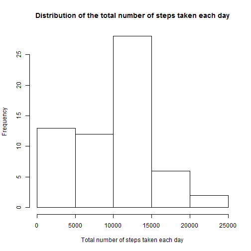
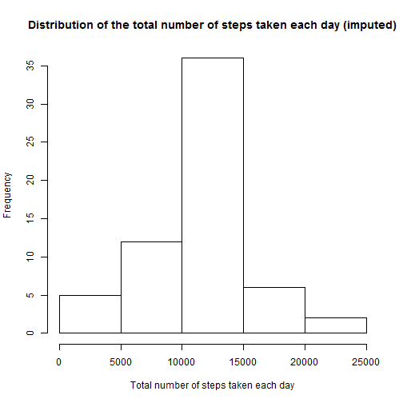
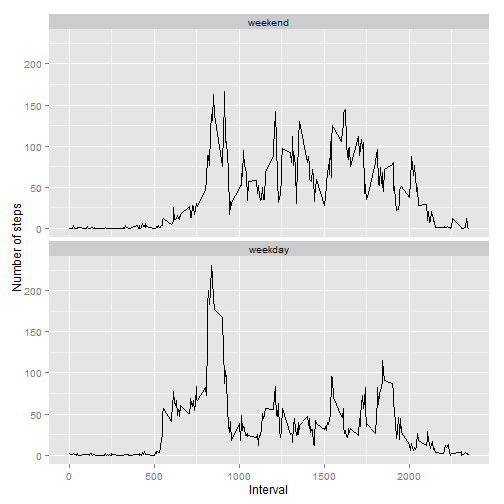

## Initialization

The following code was used to:  
(a) load the knitr package  
(b) make echo = TRUE and message = FALSE as default  
(c) suppress scientific notation


```r
if (!require("knitr")){
  install.packages("knitr")
  library(knitr)
}
opts_chunk$set(echo=TRUE,message=FALSE)
options(scipen=999)
```

## Loading and preprocessing the data


```r
# The data files activity.csv should be in the working dir,
# and the zip file containing them can be downloaded at:
# https://d396qusza40orc.cloudfront.net/repdata%2Fdata%2Factivity.zip

activity = read.table("activity.csv",header=TRUE,
                      stringsAsFactors=FALSE, sep=",",
                      na.strings="NA")
activity = transform(activity,date=as.Date(date,format="%Y-%m-%d"))
```

## What is mean total number of steps taken per day?

### Calculate the total number of steps taken per day

The missing values in the "steps" variable were ignored. So effectively, a NA would contribute zero towards the total.


```r
if(!require(plyr)){
  install.packages("plyr")
  library(plyr)
}
dailySteps = ddply(activity,"date",summarise,totalSteps = sum(steps,na.rm = TRUE))
```

### Make a histogram of the total number of steps taken each day


```r
hist(dailySteps$totalSteps,
     main = "Distribution of the total number of steps taken each day",
     xlab = "Total number of steps taken each day")
```

 

### Calculate and report the mean and median of the total number of steps taken per day


```r
meanDailySteps = mean(dailySteps$totalSteps)
medianDailySteps = median(dailySteps$totalSteps)
```

Rounded to 2 decimal places,  
(a) the mean of the total number of steps taken per day = 9354.23  
(b) the median of the total number of steps taken per day = 10395.00

## What is the average daily activity pattern?

### Make a time series plot of the 5-minute interval (x-axis) and the average number of steps taken, averaged across all days (y-axis)

The missing values in the "steps" variable were ignored. 


```r
averageSteps5min = ddply(activity,"interval",summarise,averageSteps = mean(steps,na.rm = TRUE))
plot(averageSteps5min,type="l",
     ylab = "Average number of steps taken",
     xlab = "5-min interval",
     main = "Variation of steps taken within a day (averaged across all days)")
```

 

### Which 5-minute interval, on average across all the days in the dataset, contains the maximum number of steps?


```r
maxInterval = averageSteps5min[which.max(averageSteps5min$averageSteps),"interval"]
```

The 5-minute interval that contains the maximum number of steps is 835.

## Imputing missing values

### Calculate and report the total number of missing values in the dataset


```r
rowcountNA = sum(is.na(activity$steps))
```

The total number of missing values in the dataset is 2304.

### Create a new dataset that is equal to the original dataset but with the missing data filled in by imputed values

The mean for that 5-minute interval was used to replace the NA values.


```r
imputedActivity = activity
imputedActivity$imputedSteps = activity$steps
imputedActivity = ddply(imputedActivity,"interval",mutate,
                        imputedSteps = ifelse(is.na(steps),
                        averageSteps5min[averageSteps5min$interval==interval,"averageSteps"],
                        steps))
imputedActivity = arrange(imputedActivity,date,interval)
```

### Make a histogram of the total number of steps taken each day with the imputed data


```r
imputedDailySteps = ddply(imputedActivity,"date",summarise,totalSteps=sum(imputedSteps))
hist(imputedDailySteps$totalSteps,
     main = "Distribution of the total number of steps taken each day (imputed)",
     xlab = "Total number of steps taken each day")
```

 

### Calculate and report the mean and median total number of steps taken per day with the imputed data


```r
meanImputedDailySteps = mean(imputedDailySteps$totalSteps)
medianImputedDailySteps = median(imputedDailySteps$totalSteps)
```

After imputing,  
(a) the mean of the total number of steps taken per day changed from 9354.23 to 10766.19 (diff = 1411.96)  
(b) the median of the total number of steps taken per day changed from 10395.00 to 10766.19 (diff = 371.19)

## Are there differences in activity patterns between weekdays and weekends?

### Create a new factor variable in the dataset with two levels - "weekday" and "weekend" 


```r
imputedActivity$wd = factor(rep("weekday",nrow(imputedActivity)),
                            levels=c("weekend","weekday"))
imputedActivity[which(weekdays(imputedActivity$date)=="Sunday"|
                      weekdays(imputedActivity$date)=="Saturday"),"wd"] = "weekend"
```

### Make a panel plot containing a time series plot of the 5-minute interval (x-axis) and the average number of steps taken, averaged across all weekday days or weekend days (y-axis)


```r
averageSteps5minWd = ddply(imputedActivity,.(interval,wd),summarise,averageSteps = mean(imputedSteps))
if(!require(ggplot2)){
  install.packages("ggplot2")
  library(ggplot2)
}
wplot = ggplot(averageSteps5minWd, aes(x=interval,y=averageSteps)) +
  geom_line() +
  facet_wrap(~wd,ncol=1) +
  labs(x="Interval", y="Number of steps")
print(wplot)
```

 

From the panel plot, it can be seen that:  
(a) the number of steps began to increase earlier for weekday, probably because the subject has to wake up earlier for work or school : )  
(b) the number of steps, from interval 1000 to 2000, seemed to be higher for weekend, probably due to a higher degree of freedom to walk around (no need to sit in a chair at work or at school)
